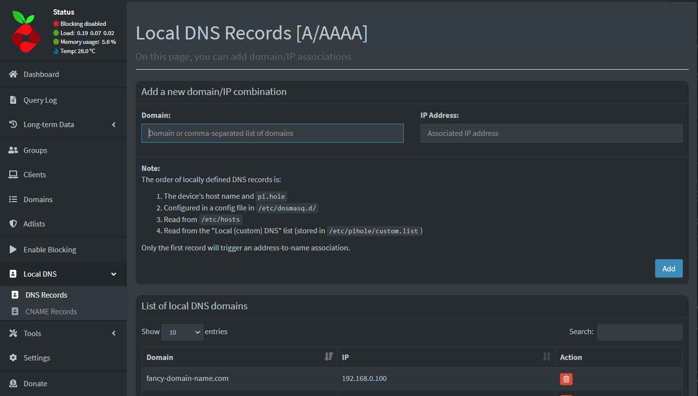
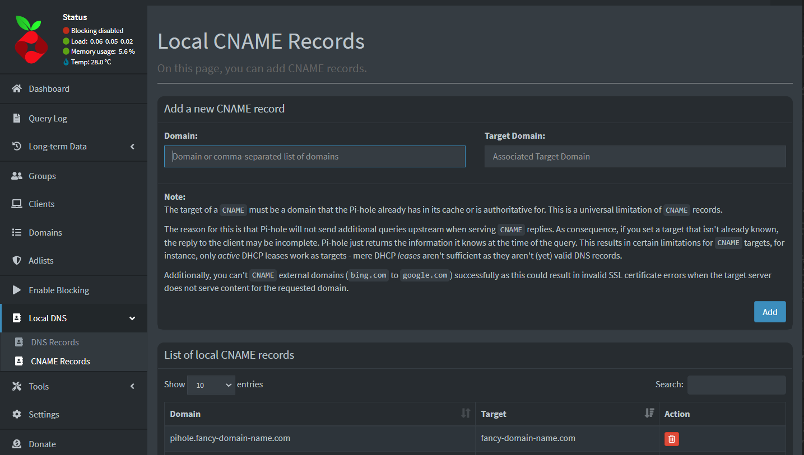

# Pi-hole

- [Pi-hole](https://pi-hole.net)
- [Pi-hole docs](https://docs.pi-hole.net)

> The Pi-hole® is a DNS sinkhole that protects your devices from unwanted content, without installing any client-side software.

In our case, Pi-hole will act as:

- Local DNS server, which will allow you to use your domain name within LAN to access your home server.
- Ad blocker. Pi-hole uses lists of ads and other unwanted domains to filter out unwanted traffic

👀 Check out [Resources](#resources) section for more info and guides

## Service setup

### Starting up Pi-hole with a Docker

Until **Traefik** is not set up, it is better to keep port 80 accessible from outside of the container's network, so you can access the Pi-hole admin panel.

**Configs:**

- [Docker compose file](./docker-compose.yml)
- [env file with required and optional environment variables](./.env)

**Guides:**

- [Using Pi-Hole for Local DNS - Fast, Simple, and Easy Guide](https://youtu.be/kKsHo6r4_rc)
- [World's Greatest Pi-hole Tutorial](https://youtu.be/cE21YjuaB6o)
- [Ultimate Pi-hole configuration guide, SSL certificates, automatic updates, automatic sync, more!](https://youtu.be/U7zrlDF7XHU)
- [Docker Pi-hole](https://github.com/pi-hole/docker-pi-hole)

A detailed list of Pi-hole env variables and their description can be found at the following link: [Docker Pi-hole - Environment Variables](https://github.com/pi-hole/docker-pi-hole#environment-variables)

Pi-hole could be quickly started with Docker, but there are some tricks on Ubuntu and Fedora OS. Pi-hole uses 53 TCP/UDP ports. The exact ports also are used by **system-resolved** service. So the first run of the Pi-hole container will end up with an error. 
The problem could be solved by following the guide below:

- [Docker Pi-hole - Installing on Ubuntu or Fedora](https://github.com/pi-hole/docker-pi-hole#installing-on-ubuntu-or-fedora)

The drawback of the solution above is that if the Pi-hole container is not running, your server's domain name resolution will probably be **unavailable**.

### DNS configuration

The next step is to map your domain name with the server static LAN IP. 
To do so, you need to add an **A/AAAA** record for your domain.

  
Pi-hole local DNS A/AAAA records config example

The last step is to add **CNAME** records for services for your domain. 
It is helpful in case your server's LAN IP address changes. In this case, you'll need to remap only the A/AAAA record for your domain name.

In advance, let's add CNAME records for Pi-hole, Portainer, and Traefik services.

  
Pi-hole local DNS CNAME records config example

**Note**

**✎** Services CNAME records should be equal to **SERVICE_URL** in Traefik integration.

**✎** If you want to use a domain name you don't own or do not exist, you will be limited to obtaining **only self-signed** SSL certificates.

**✎** For every new service on your home server, which you want to access by domain name, you need to create a separate CNAME record.

### Router DHCP server configuration

Remember, you have set up the router DHCP server in one of the previous steps: [The basis for the local DNS server](../../setup-guide/router-configuration.md#the-basis-for-the-local-dns-server). 
So now you are ready to use your domain name to access your home server and its services.

**Note**

**✎** On Chrome and probably other browsers, you may face the situation when your "local" domain name isn't adequately resolved. The problem is that browsers sometimes ignore the system DNS config and use their own configs. Unfortunately, I still have not overcome this problem entirely yet. 
Here are a few ways to solve or live with it:

- Using incognito mode
- [Chrome] Clear Chrome's DNS cache with the help of the `chrome://net-internals/#dns` page
- [Force Chrome and Edge to use local DNS](https://bugdrivendevelopment.net/browser-ignore-internal-dns/)

➡️ [**The next step: Traefik**](../traefik/README.md)

## Resources

### YouTube

- [Using Pi-Hole for Local DNS - Fast, Simple, and Easy Guide](https://youtu.be/kKsHo6r4_rc)
- [World's Greatest Pi-hole Tutorial](https://youtu.be/cE21YjuaB6o)
- [Ultimate Pi-hole configuration guide, SSL certificates, automatic updates, automatic sync, more!](https://youtu.be/U7zrlDF7XHU)

### Docs & articles

- [Pi-hole](https://pi-hole.net)
- [Pi-hole docs](https://docs.pi-hole.net)
- [Docker Pi-hole](https://github.com/pi-hole/docker-pi-hole)

### Problems & solutions

- [Docker Pi-hole - Installing on Ubuntu or Fedora](https://github.com/pi-hole/docker-pi-hole#installing-on-ubuntu-or-fedora)
- [Force Chrome and Edge to use local DNS](https://bugdrivendevelopment.net/browser-ignore-internal-dns/)

### Configs

- [Docker compose file](./docker-compose.yml)
- [env file with required and optional environment variables](./.env)
