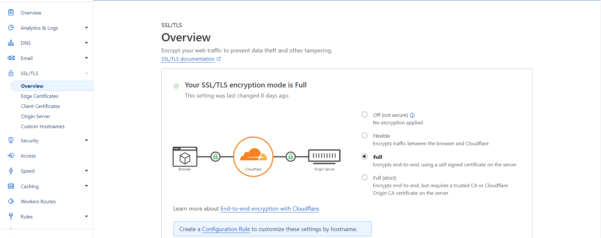

# Cloudflare

Our last step is to buy and set up a domain name via Cloudflare. It sounds easy, and it is, but there may be a few pitfalls. So let's walk through this process together.

I am using [**Cloudflare**](https://www.cloudflare.com/) as a service that handles my domain name and it's security. It has many features, like DDoS attack protection, auto SSL certificate generation, and more. 
But need to be mentioned one of the core features - request proxying. This feature hides your IP address when somebody accesses your home server services by the domain name.

👀 Check out [Resources](#resources) section for more info and guides

## Purchasing a domain name

By buying your domain name, you can generate fully valid and up-to-date SSL certificates is better. To have a handy way to access your home server services from the Internet.

In the current setup, I've purchased my domain name on [GoDaddy](https://www.godaddy.com/uk-ua). Of course, you can use another domain vendor, for example, **Cloudflare**. Just make sure that it supports **domain transfer** to Cloudflare.
Also, not all TLDs (Top-level domains) are supported by Cloudflare, so check if a domain name you want to buy is backed by Cloudflare by the link below.

- [TLD Policies](https://www.cloudflare.com/tld-policies/)

## Transferring a domain on Cloudflare

Down below, you can find links to domain transferring and basic Cloudflare setup tutorials:

**YouTube**

- [How to Setup Cloudflare DNS (2022 update) [FAST]](https://youtu.be/XQKkb84EjNQ)
- [Half price domains forever - how to transfer domains to Cloudflare](https://youtu.be/rYSCJg4-WAw)
- [How to Use Cloudflare' to Speed up and Secure your Website! (Tutorial)](https://youtu.be/hHaPgfyxIvY)
- [How to Install and Setup Traefik with Cloudflare Using Your Own Domain](https://youtu.be/b83S_N1kkJM)
- [Cloudflare - FREE Additional Security For Your Home Server!](https://youtu.be/m-RYTu-Qq3A)

**Docs**

- [Transfer your domain to Cloudflare](https://developers.cloudflare.com/registrar/get-started/transfer-domain-to-cloudflare/)

**Note**

**✎** Giving domain name renewal control to Cloudflare is an optional step. You still be able to use all features described above without it.

**✎** After a successful DNS control transfer to Cloudflare, you must set SSL/TLS encryption mode to **Full**. 
I had **Flexible** mode activated by default, and it caused a **Too Many Redirects** error when I was trying to access my home server services from the Internet.

  
Cloudflare SSL/TLS encryption mode configuration example

## Mapping public IP address with your domain name

### Static IP address

If you are the lucky owner of a static IP address, you just need to map it with your domain name via **DNS** **A** record on a Cloudflare **Websites** -> **Your domain name** -> **DNS** -> **Records** settings section. And that's it. You are ready to go!

### Dynamic IP address

Unfortunately, by default, ISPs (Internet Service Providers) rarely give a static IP address to their clients. 
More likely, you have a **dynamic** IP address, which means, that it changes occasionally. So you need to keep **A** **DNS** record IP address up-to-date. You can use **DDNS** (Dynamic DNS) for that purpose.
Down below, you can find links to tutorials about how to set up **DDNS** with **Cloudflare**.

- [CloudFlare DDNS - Update CloudFlare with Your Dynamic IP Address](https://youtu.be/Nf7m3h11y-s)
- [DDNS on a Raspberry Pi using the Cloudflare API (Dynamic DNS)](https://youtu.be/rI-XxnyWFnM)

⚠️But there might be a pitfall with dynamic IP addresses. In some cases, it is **impossible** to use it to reach out to your home server, even if it is up-to-date. It could be caused by your ISP restrictions, etc. 
In this case, you have a few options:

- Buy a static IP address (which I did)
- **Cloudflare Tunnel**, which will be described in a following section

### Cloudflare Tunnel

**Cloudflare Tunnel** is a mighty service but not a silver bullet. It has some limitations as well. More info you will find in the following video:

- [You should NOT use Cloudflare Tunnel (if you do this...)](https://youtu.be/oqy3krzmSMA)

If you think that it fits you - try it out, it's free. More guides you can find down below:

**Docs**

- [Cloudflare Tunnel](https://developers.cloudflare.com/cloudflare-one/connections/connect-apps/)

**YouTube**

- [How to use Cloudflare Tunnel in your Homelab (even with Traefik)](https://youtu.be/yMmxw-DZ5Ec)
- [Cloudflare Tunnels: Getting Started with Domains, DNS, and Tunnels](https://youtu.be/Q5dG8g4-Sx0)

➡️ [**The next step: Resume**](./README.md#resume)

## Resources

### YouTube

- [How to Setup Cloudflare DNS (2022 update) [FAST]](https://youtu.be/XQKkb84EjNQ)
- [Half price domains forever - how to transfer domains to Cloudflare](https://youtu.be/rYSCJg4-WAw)
- [How to Use Cloudflare' to Speed up and Secure your Website! (Tutorial)](https://youtu.be/hHaPgfyxIvY)
- [How to Install and Setup Traefik with Cloudflare Using Your Own Domain](https://youtu.be/b83S_N1kkJM)
- [Cloudflare - FREE Additional Security For Your Home Server!](https://youtu.be/m-RYTu-Qq3A)
- [CloudFlare DDNS - Update CloudFlare with Your Dynamic IP Address](https://youtu.be/Nf7m3h11y-s)
- [DDNS on a Raspberry Pi using the Cloudflare API (Dynamic DNS)](https://youtu.be/rI-XxnyWFnM)
- [You should NOT use Cloudflare Tunnel (if you do this...)](https://youtu.be/oqy3krzmSMA)
- [How to use Cloudflare Tunnel in your Homelab (even with Traefik)](https://youtu.be/yMmxw-DZ5Ec)
- [Cloudflare Tunnels: Getting Started with Domains, DNS, and Tunnels](https://youtu.be/Q5dG8g4-Sx0)

### Docs & articles

- [TLD Policies](https://www.cloudflare.com/tld-policies/)
- [Transfer your domain to Cloudflare](https://developers.cloudflare.com/registrar/get-started/transfer-domain-to-cloudflare/)
- [Cloudflare Tunnel](https://developers.cloudflare.com/cloudflare-one/connections/connect-apps/)
