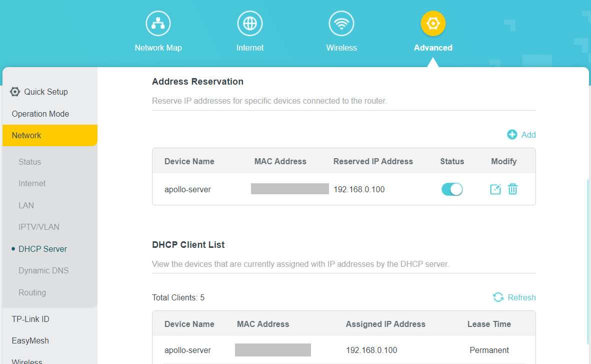
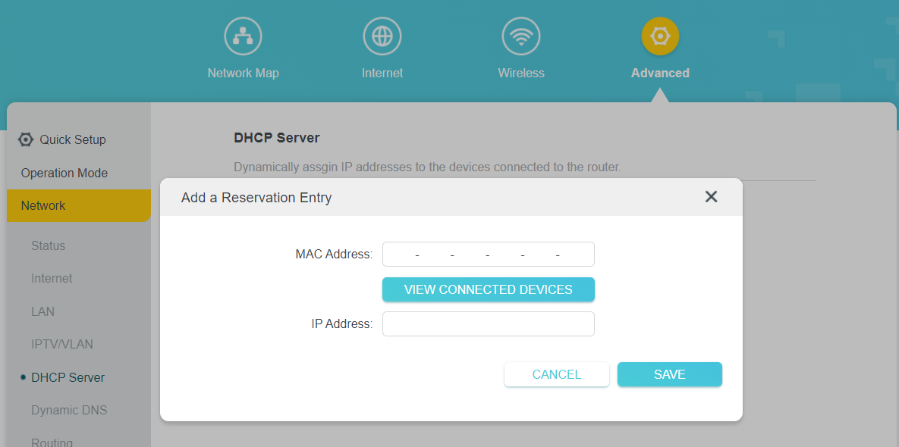
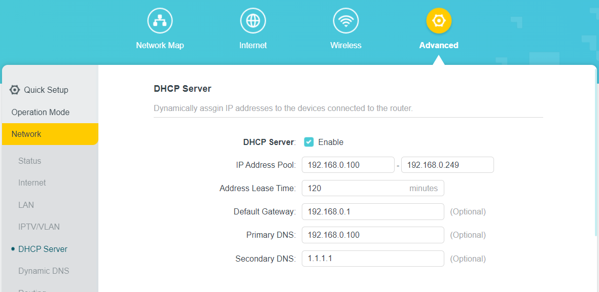
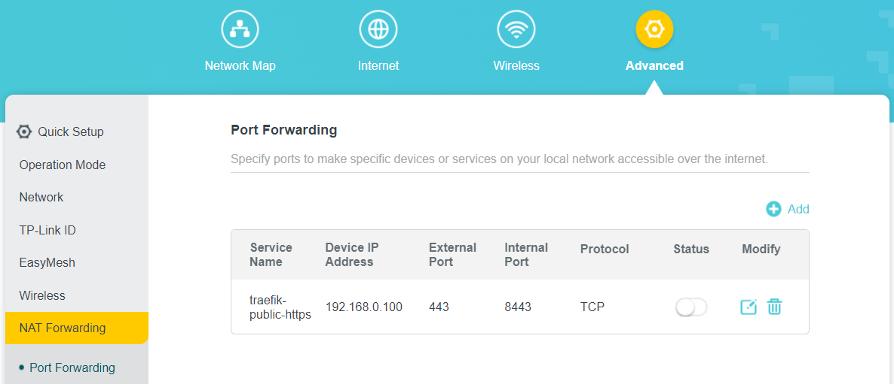
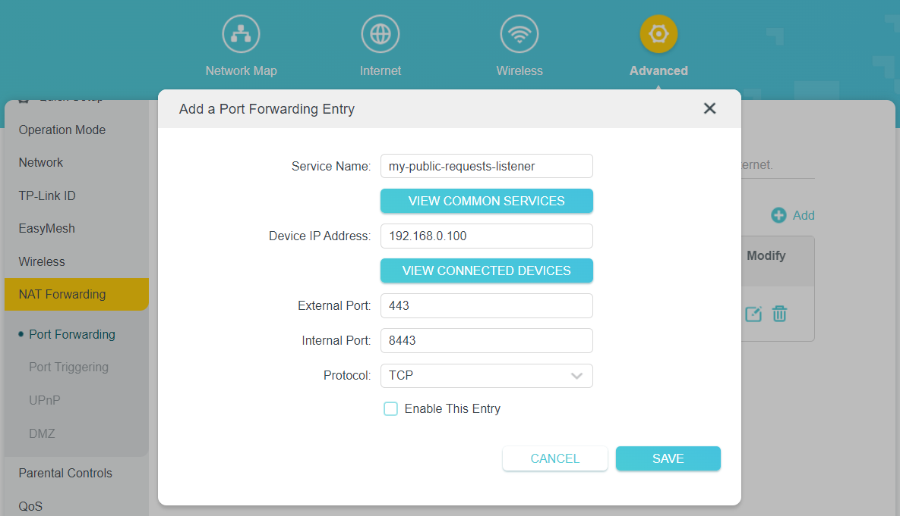

# Router configuration

In this step, you will configure a home server static LAN IP address. Also, you will create the basis for using the home server as a local DNS server, accessing the home server from the Internet

## Setting up

The following configuration steps are described with an example of a **TP-Link** router. 
But don't worry if you have a router from another vendor, just take a look at its documentation, the steps should be pretty similar.

Also, all router configuration is performed via its admin panel. 
In my case, the admin panel is accessible by the following URL: [http://192.168.0.1](http://192.168.0.1).

Steps "The basis for the local DNS server" and "The basis for accessing the home server from the Internet" - are configurations in advance for future steps. 
The upcoming guides will provide information about their purpose and a more detailed description.

### Server static LAN IP address

To set a static IP address to your home server, you need to:

- Navigate to **Advanced** -> **Network** -> **DHCP server**
- In the **Address Reservation** section, add your home server's IP address

That's it! Now your home server has a static LAN IP address.

  
Static IP config example

  
Static IP config example - Adding Reservation Entry

### The basis for the local DNS server

Now let's configure the router's DHCP server, which will allow you to use your home server as the primary DNS server in the future.

To do so:

- Navigate to **Advanced** -> **Network** -> **DHCP server**
- In the **DHCP Server** section, set your home server LAN IP address (which is static now) as the **Primary DNS**
- (Optional) As **Secondary DNS** set Cloudflare DNS server IP address (1.1.1.1)

  
Local DNS server config example

### The basis for accessing the home server from the Internet

To make your home server accessible from the Internet, you must configure a port forwarding on your router.

By port forwarding configuration, you can control the following:

- Which of your router ports are ready to receive requests from the Internet
- What kind of requests are those ports accepting
- What home server port should be mapped to a public router port

To do so:

- Navigate to **Advanced** -> **Network** -> **NAT Forwarding** -> **Port Forwarding**
- Click on **Add**
- Choose an arbitrary service name
- Insert your home server LAN IP address as **Device IP Address**
- Set 443 as the value of the **External Port**. In the current setup, we want to forward only HTTPS requests from the Internet to the home server
- Set 8443 as the value of the **Internal Port**. In the current setup, the 8443 port on the home server is dedicated to listening for all public HTTPS requests
- Choose **TCP** protocol only
- Uncheck **Enable This Entry** checkbox. For the sake of security, let it be disabled for now. You will activate it on the following steps.

  
Port forwarding config example

  
Port forwarding config example - Adding Port Forwarding Entry

➡️ [**The next step: Setting up basic security**](./setting-up-basic-security.md)
